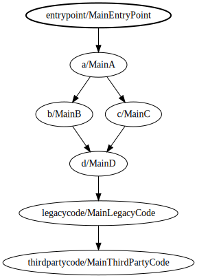

# Java 9 Modules

## Concepts
- modules are conceptually one level above a package
- they tend to be at the same level as an individual .jar file that does not include other .jar files
- modules specify dependency relationships among one another
- modules specify which packages have their public types available to other modules that depend on them
- modules have nothing at all to do with a versioning system, and they do not specify versions

## Types of paths
- class path
- module path (defined by the host system)

## Types of modules
- unnamed module (legacy)
    - code compiled by Java 9 that does not have a module descriptor and is not on the module path
    - reads all modules
    - readable by all automatic modules
    - not readable by modules
- module (encapsulated)
    - code that has a module descriptor and is on the module path
    - reads modules it specifies with a "requires" declaration
    - readable by modules, if they declare it with their own "requires" declaration
    - readable by the unnamed module
    - may not read the unnamed module
    - legacy code can be incrementally converted to modules from the bottom up
    - represented as a regular .jar file with the addition of a module-info.class file at the root
- automatic module (anarchy)
    - code that does not have a module descriptor, but is on the module path
    - reads all modules
    - reads the unnamed module
    - readable by modules, if they declare it with their own "requires" declaration
    - readable by all automatic modules
    - readable by the unnamed module
    - can be used as a bridge between modules and legacy code when bottom up conversion to modules is not practical
    - represented as a regular .jar file placed on a module path
    - the module name is derived from the name of the .jar file

## Packages
- Modules use "exports" declarations to indicate which packages are readable by other modules
- Only public types are exported
- It is a compile time error for two modules to export the same package
- When a package can be loaded from either the module path or the class path, the module path is searched first
- Apparent relationships between module names and package names have no significance with regards to behavior, it is convention only

## Examples
- 
- [MainEntryPoint](entry-point/src/main/java/com/seanshubin/learn/module/entrypoint/MainEntryPoint.java) is in the unnamed module, so it can access [MainA](module-a/src/main/java/com/seanshubin/learn/module/a/MainA.java) in the module [learn.module.a](module-a/src/main/java/module-info.java)
- [MainA](module-a/src/main/java/com/seanshubin/learn/module/a/MainA.java) is in module [learn.module.a](module-a/src/main/java/module-info.java), which requires module [learn.module.b](module-b/src/main/java/module-info.java), so it can access [MainB](module-b/src/main/java/com/seanshubin/learn/module/b/MainB.java)
- [MainLegacyCode](legacy-code/src/main/java/com/seanshubin/learn/module/legacycode/MainLegacyCode.java) is in the automatic module [learn.module.legacycode](legacy-code/pom.xml), so it can see [MainThirdPartyCode](third-party-code/src/main/java/com/seanshubin/learn/module/thirdpartycode/MainThirdPartyCode.java) in the unnamed module
